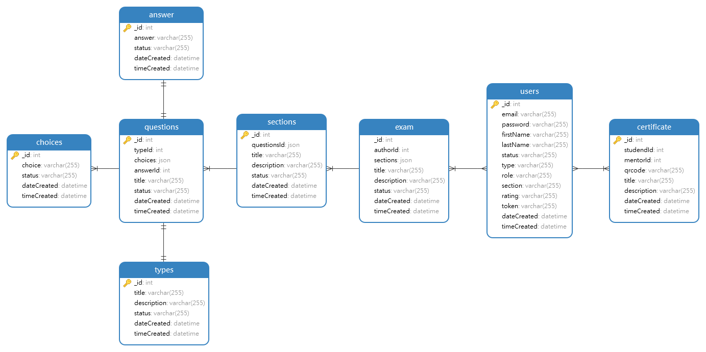
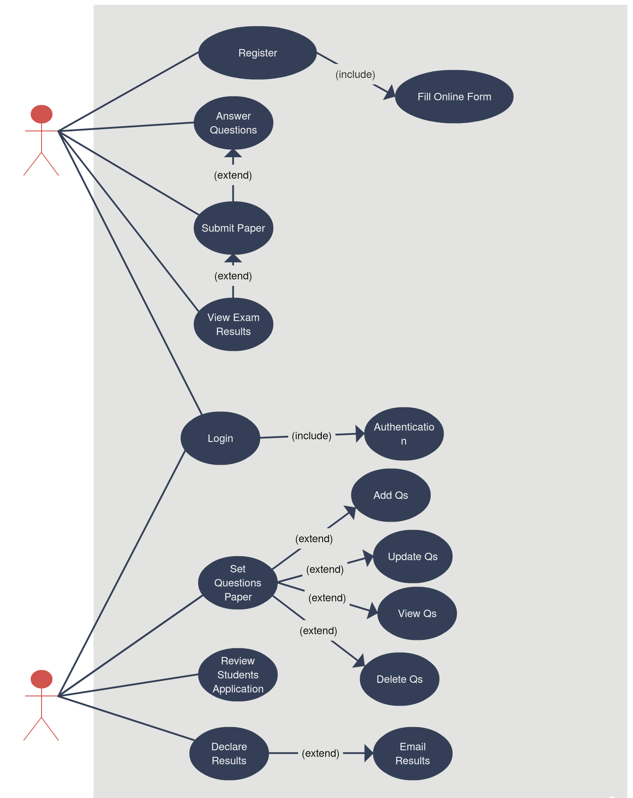

# Full-stack MERN team project

## Developer

Anton Tagaruma, Jefferson Rosimo & Samuel Corpuz

## About the app

This is a Fullstack MERN team project entitled Exam Management System (EMS).

### User stories

1. As a mentor, I should be able to create a multiple choice question.
2. As a mentor, I should be able to choose the correct answer to the question I made.
3. As a mentor, I should be able to update the exam I made
4. As a mentor, I should be able to login
5. As a student, I should be able to login
6. As a student, I should be able to take an exam
7. As a student, I should be able to see my exam result

#### Technologies used

- MongoDB
- ExpressJS
- NodeJS
- ReactJS
- react-redux
- react-router
- react-router-dom
- thunder client
- mongoose
- morgan
- body-parser
- bcrypt
- cors (cross-origin resource sharing)
- helmet

---

### Entity Relationship Diagram (ERD)

### UML

